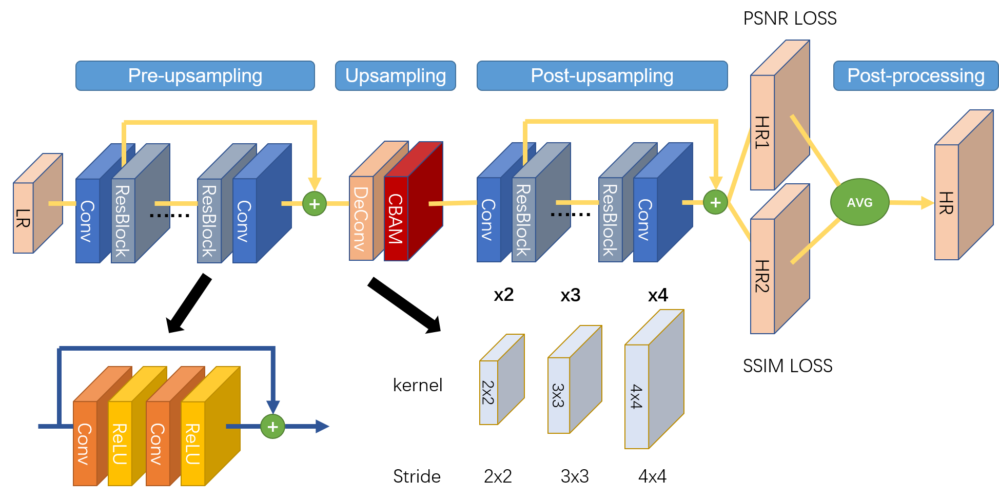
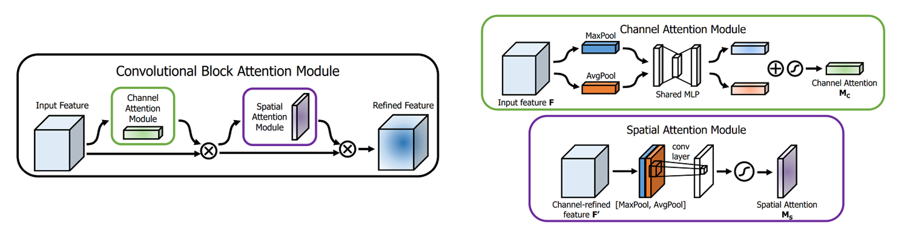
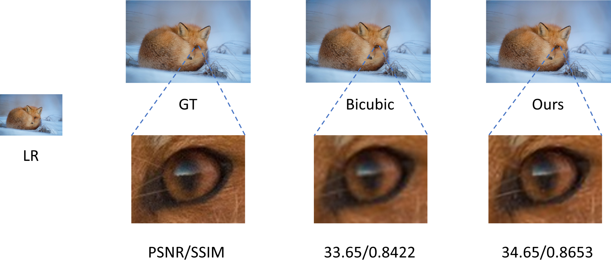

# AMLS_II_assignment20_21
In this paper, we have developed a novel deep super-resolution network. In particular, the residual learning techniques has been used to design a deeper network and make the backbone more powerful. We design two generating branches at the end of the model in a multi-task learning fashion, which are optimized with a joint loss of SSIM and PSNR. Also, a CBAM attention block has been used to adaptively improve the feature extraction where the local details are hard to restore. Lastly, the data augmentation trick helps us to generate more training samples. The proposed method shows competitive performance on the benchmark dataset and proves its excellence compared with other models in the NTIRE2017 Super-Resolution Challenge.

## Model
  

 

CBAM Block:
  

## Requirements

* tensorflow
* tensorflow_datasets

## Running
Before running the code, you need `pip install tensorflow_datasets`.
The dataset of DIV2K will be prepared automatically by the library `tensorflow_datasets`

To run the training pipeline, you just need `python main.py`

To change the running track, you just need to update the dataset name in `config.json`

Optional datasets: `div2k/bicubic_x2` `div2k/bicubic_x3` `div2k/bicubic_x4` `div2k/unknown_x2` `div2k/unknown_x3` `div2k/unknown_x4`

## Results

|    Track   | Val PSNR | Val SSIM | Test PSNR | Test SSIM |
|:----------:|:--------:|:--------:|:---------:|:---------:|
| bicubic_x2 |   34.17  |  0.9350  |   33.99   |   0.9359  |
| bicubic_x3 |   31.03  |  0.8735  |   29.27   |   0.8633  |
| bicubic_x4 |   27.23  |  0.7923  |   27.41   |   0.7885  |
| unknown_x2 |   32.11  |  0.9089  |   32.17   |   0.9094  |
| unknown_x3 |   30.53  |  0.8622  |   28.81   |   0.8506  |
| unknown_x4 |   24.67  |  0.7303  |   24.94   |   0.7250  |

## Example
  
